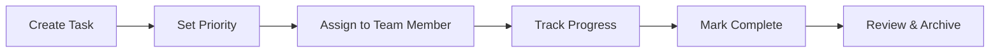

# 🚀 VIBESANA - AI-Powered Task Management Platform

<div align="center">


**The future of task management is here. Vibesana combines intuitive design with AI-powered productivity to help you and your team achieve more.**

[](https://reactjs.org/)
[](https://www.typescriptlang.org/)
[](https://supabase.com/)
[](https://tailwindcss.com/)

[🌟 Live Demo](https://vibesana-task-genie.lovable.app/) • [📖 Documentation](https://docs.lovable.dev/) • [💬 Discord Community](https://discord.com/channels/1119885301872070706/1280461670979993613)

</div>

---

## ✨ What is Vibesana?

Vibesana is a **next-generation task management platform** that revolutionizes how teams organize, track, and complete their work. Built with a retro-futuristic aesthetic and powered by AI, Vibesana transforms complex project management into an intuitive, visual experience.

### 🎯 Core Philosophy

> "Great teams need great tools. Vibesana eliminates the friction between thinking and doing."

Our platform bridges the gap between high-level project planning and day-to-day execution, making productivity feel effortless and engaging.

---

## 🌟 Key Features

### 🧠 **AI-Powered Task Breakdown**
- **Smart Task Decomposition**: Break down complex projects into manageable subtasks using AI
- **Intelligent Suggestions**: Get AI-powered recommendations for task priorities and assignments
- **Natural Language Processing**: Create tasks by simply describing what needs to be done

### 📋 **Dual-View Task Management**
- **Kanban Board View**: Drag-and-drop interface with real-time status updates
- **List View**: Clean, organized task listing with advanced filtering
- **Seamless Switching**: Toggle between views without losing context

### 🎨 **Retro-Futuristic Design**
- **Neon Aesthetics**: Eye-catching visual elements that make work feel engaging
- **Dark Theme**: Reduce eye strain during long work sessions
- **Responsive Design**: Perfect experience across desktop, tablet, and mobile

### 🔐 **Secure & Scalable**
- **User Authentication**: Secure sign-up/sign-in with Supabase Auth
- **Real-time Sync**: Changes are instantly reflected across all devices
- **Data Persistence**: Your tasks are safely stored in the cloud

### 🚀 **Advanced Functionality**
- **Smart Filtering**: Find tasks by status, priority, assignee, or custom criteria
- **Search Everything**: Quickly locate tasks with intelligent search
- **Progress Tracking**: Visual indicators for project and task completion
- **Team Collaboration**: Multi-user support with role-based permissions

---

## 🔬 AI Optimization with Comet Opik

Vibesana integrates with [**Comet Opik**](https://www.comet.com/opik) to provide advanced AI optimization and monitoring capabilities for the task breakdown functionality.

### 🎯 **What is Comet Opik?**

Comet Opik is an end-to-end LLMOps platform that helps teams build, evaluate, and monitor AI applications. In Vibesana, Opik powers intelligent task optimization and complexity analysis.

### 🧠 **AI Task Optimization Features**

- **Complexity Scoring**: Automatically analyze task complexity to determine optimal breakdown levels
- **Intelligent Sub-tasking**: Generate additional sub-tasks when a task is deemed too complex
- **Performance Monitoring**: Track AI model performance and task generation quality
- **Optimization Insights**: Get data-driven insights to improve task breakdown accuracy

### 📊 **How It Works**

1. **Task Analysis**: When you use AI Task Breakdown, Opik analyzes the generated tasks
2. **Complexity Assessment**: Each task receives a complexity score based on multiple factors
3. **Automatic Refinement**: Tasks exceeding complexity thresholds are automatically broken down further
4. **Continuous Learning**: The system learns from user interactions to improve future task generation

### 🔧 **Benefits for Teams**

- **Reduced Overwhelm**: Complex tasks are automatically broken into manageable pieces
- **Better Planning**: More accurate time estimates through intelligent task sizing
- **Improved Productivity**: Teams can focus on execution rather than task planning
- **Data-Driven Insights**: Understanding of what makes tasks effective for your team

### 📈 **Monitoring & Analytics**

Opik provides comprehensive monitoring for the AI task breakdown process:

- **Generation Quality Metrics**: Track the effectiveness of AI-generated tasks
- **User Satisfaction Scoring**: Monitor how well generated tasks meet user needs
- **Performance Optimization**: Continuous improvement of task breakdown algorithms
- **Usage Analytics**: Understand patterns in how your team uses AI assistance

---

## 🛠 Tech Stack

Vibesana is built on modern, battle-tested technologies:

| Technology | Purpose | Version |
|------------|---------|---------|
| **React** | Frontend Framework | 18.3.1 |
| **TypeScript** | Type Safety | 5.0+ |
| **Vite** | Build Tool | 5.4+ |
| **Tailwind CSS** | Styling | 3.0+ |
| **Shadcn/UI** | Component Library | Latest |
| **Supabase** | Backend & Database | 2.50+ |
| **Comet Opik** | AI Optimization | Latest |
| **@dnd-kit** | Drag & Drop | 6.3+ |
| **React Query** | Data Fetching | 5.56+ |
| **Lucide React** | Icons | Latest |

---

## 🚀 Quick Start

### Prerequisites

- **Node.js** 18+ and **npm** (install with [nvm](https://github.com/nvm-sh/nvm#installing-and-updating))
- **Git** for version control

### Installation

1. **Clone the repository**
   ```bash
   git clone <YOUR_GIT_URL>
   cd <YOUR_PROJECT_NAME>
   ```

2. **Install dependencies**
   ```bash
   npm install
   ```

3. **Start the development server**
   ```bash
   npm run dev
   ```

4. **Open your browser**
   Navigate to `http://localhost:5173` to see Vibesana in action!

### Environment Setup

Create a `.env.local` file in the root directory and add your Supabase credentials:

```env
VITE_SUPABASE_URL=your_supabase_url
VITE_SUPABASE_ANON_KEY=your_supabase_anon_key
```

---

## 📖 How to Use Vibesana

### Getting Started

1. **Sign Up**: Create your account using the secure authentication system
2. **Create Your First Task**: Click the "NEW TASK" button to get started
3. **Organize with Kanban**: Drag tasks between TO DO, IN PROGRESS, REVIEW, and DONE columns
4. **Use AI Assistance**: Try the AI Task Breakdown feature for complex projects

### Task Management Workflow



### Best Practices

- **Use descriptive titles**: Make it clear what needs to be accomplished
- **Set realistic due dates**: Help your team manage expectations
- **Leverage AI suggestions**: Let the AI help break down complex tasks
- **Regular status updates**: Keep the board current with real progress

---

## 🎮 Features Deep Dive

### 🎯 Task Creation & Management

- **Quick Creation**: Add tasks in seconds with the intuitive form
- **Rich Descriptions**: Support for detailed task descriptions
- **Priority Levels**: Low, Medium, High priority classification
- **Due Date Tracking**: Never miss a deadline
- **Assignee Management**: Assign tasks to team members

### 🔄 Kanban Board

- **Drag & Drop**: Intuitive task movement between columns
- **Visual Feedback**: Clear indication of drop zones and hover states
- **Real-time Updates**: Changes sync instantly across all users
- **Status Columns**: TO DO → IN PROGRESS → REVIEW → DONE

### 🔍 Advanced Filtering

- **Multi-criteria Search**: Filter by status, priority, and assignee
- **Real-time Results**: Instant filtering as you type
- **Clear Indicators**: See active filters at a glance
- **Quick Reset**: One-click filter clearing

### 🤖 AI Integration

- **Task Breakdown**: Transform big ideas into actionable steps
- **Smart Suggestions**: AI-powered task recommendations
- **Natural Language**: Describe tasks in plain English

---

## 🎨 Design Philosophy

Vibesana's design is inspired by **retro-futuristic aesthetics** combined with **modern usability principles**:

- **Neon Accents**: Eye-catching highlights that guide user attention
- **High Contrast**: Excellent readability in all lighting conditions
- **Geometric Patterns**: Clean, structured layouts that reduce cognitive load
- **Smooth Animations**: Delightful micro-interactions that provide feedback

---

## 🚀 Deployment

### Lovable Platform (Recommended)

1. Open your [Lovable Project](https://lovable.dev/projects/4c111fe0-32cc-45f0-8361-551ca71158ef)
2. Click **Share → Publish**
3. Your app is live! 🎉

### Custom Domain

1. Navigate to **Project > Settings > Domains**
2. Click **Connect Domain**
3. Follow the setup instructions

### Self-Hosting

Deploy to any platform that supports static sites:

```bash
# Build for production
npm run build

# Deploy the 'dist' folder to your hosting provider
```

Popular hosting options:
- **Vercel**: Zero-config deployment
- **Netlify**: Continuous deployment from Git
- **AWS S3**: Scalable static hosting
- **GitHub Pages**: Free hosting for open source

---

## 🤝 Contributing

We welcome contributions from the community! Here's how you can help:

### Development Setup

1. Fork the repository
2. Create a feature branch: `git checkout -b feature/amazing-feature`
3. Make your changes
4. Run tests: `npm test`
5. Commit your changes: `git commit -m 'Add amazing feature'`
6. Push to the branch: `git push origin feature/amazing-feature`
7. Open a Pull Request

### Code Standards

- **TypeScript**: All new code must be properly typed
- **ESLint**: Follow the established linting rules
- **Prettier**: Code formatting is automatic
- **Testing**: Include tests for new features

---

## 📚 Learn More

### Resources

- 📖 [Official Lovable Documentation](https://docs.lovable.dev/)
- 🎥 [YouTube Tutorial Series](https://www.youtube.com/watch?v=9KHLTZaJcR8&list=PLbVHz4urQBZkJiAWdG8HWoJTdgEysigIO)
- 💬 [Discord Community](https://discord.com/channels/1119885301872070706/1280461670979993613)
- 📝 [Step-by-Step Quickstart Guide](https://docs.lovable.dev/user-guides/quickstart)

### API References

- [React Documentation](https://reactjs.org/docs)
- [Supabase Guides](https://supabase.com/docs)
- [Tailwind CSS](https://tailwindcss.com/docs)
- [Shadcn/UI Components](https://ui.shadcn.com/)

---

## 📄 License

This project is built with [Lovable](https://lovable.dev) and follows their terms of service.

---

## 🙏 Acknowledgments

- **Lovable Team** for the amazing development platform
- **Supabase** for the robust backend infrastructure
- **Open Source Community** for the incredible tools and libraries
- **Our Users** for feedback and feature requests that drive innovation

---

<div align="center">

**Made with ❤️ using [Lovable](https://lovable.dev)**

*Transform your productivity with Vibesana - where AI meets intuitive design*

[🚀 Get Started Now](https://vibesana-task-genie.lovable.app/) • [⭐ Star on GitHub](#) • [🐛 Report Bug](#) • [💡 Request Feature](#)

</div>
